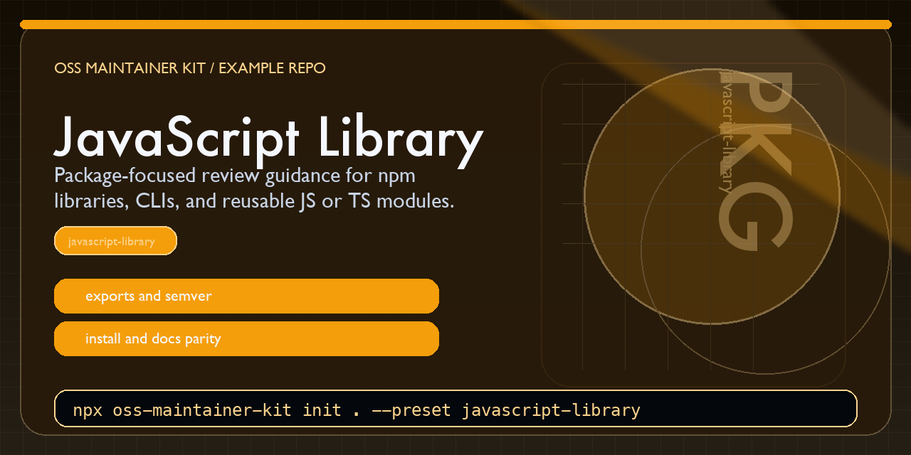

# OSS Maintainer Kit JavaScript Example



This repository shows what the `javascript-library` preset from [oss-maintainer-kit](https://github.com/BlakeHampson/oss-maintainer-kit) looks like after scaffolding.

It was generated with:

```bash
npx oss-maintainer-kit init . \
  --repo-name oss-maintainer-kit-javascript-example \
  --maintainer "Blake Hampson" \
  --preset javascript-library
```

## Why this repo exists

It is a concrete example for package authors who want to inspect the JavaScript or TypeScript preset before using it on a real npm package or CLI.

## Quick scan

- `AGENTS.md`: package-oriented review guidance
- `docs/START_HERE.md`: what the generated files are for
- `docs/MAINTAINER_WORKFLOW.md`: how PRs, issues, and releases should be handled
- `.github/workflows/codex-pr-review.yml`: optional review automation

## What this preset is trying to optimize

- package-focused review expectations
- clearer documentation around release and maintainer work
- better defaults for repositories that will likely publish code to others

## Related project

- Main tool: <https://github.com/BlakeHampson/oss-maintainer-kit>
- npm package: <https://www.npmjs.com/package/oss-maintainer-kit>
